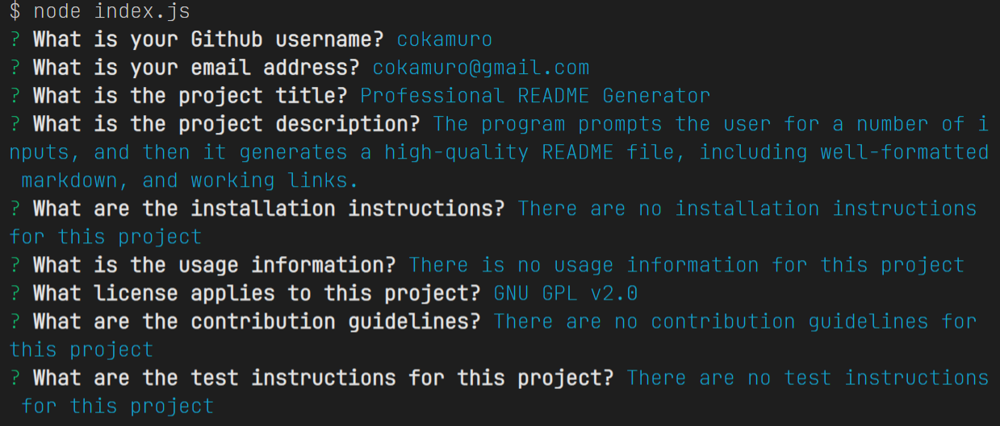
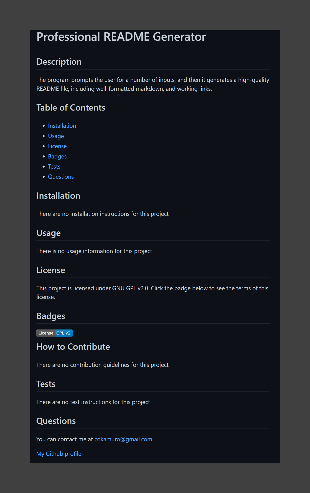

# 09 Node.js Challenge: Professional README Generator

[Walkthrough Video](https://drive.google.com/file/d/116yxeoPR-H_mjcl3_HhnE2rvv5GKHYrY/view)

## Table of Contents
- [Description](#description)
- [Visuals](#visuals)
- [Usage](#usage)

## Description
This is the solution JavaScript for the 02-Challenge assignment in the 09 Node.js Module.

The purpose of the assignment was to create a README file generator that takes user input via Inquirer module, and writes the file using the fs module.  The user is prompted for details about their contact information, and the purpose, deployment, and use of their project.  This data is merged with a template README.md file (template-readme.md), and the completed README.md file is generated in the _output_ directory.  

## Usage
The program is invoked via node at the command prompt with no arguments as follows: _node index.js_
The program requires NPM installation of the inquirer and fs modules, and requires write/create access to the _output_ subdirectory

## Visuals
### The site in operation

[Walkthrough Video (in case you didn't see it at the top of this document)](https://drive.google.com/file/d/116yxeoPR-H_mjcl3_HhnE2rvv5GKHYrY/view)
